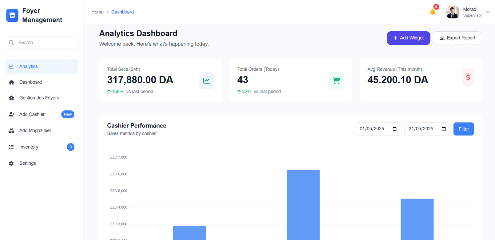
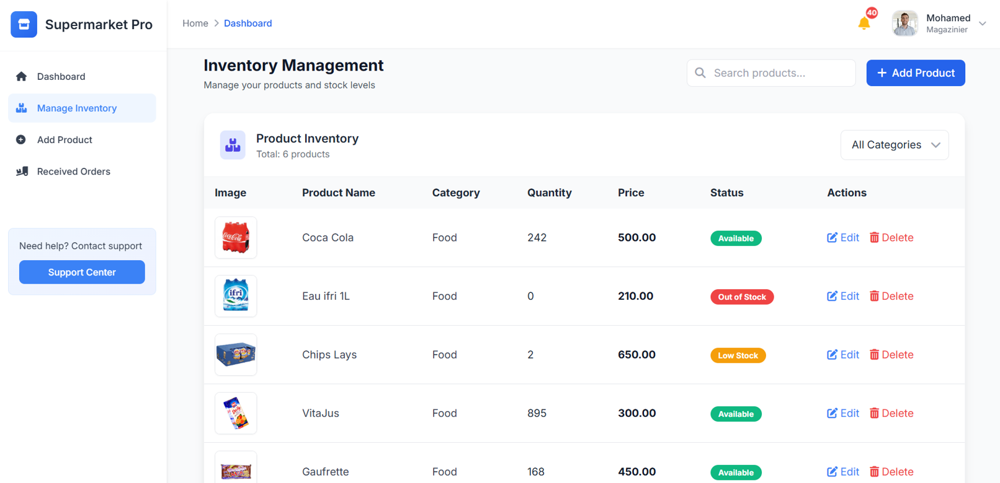
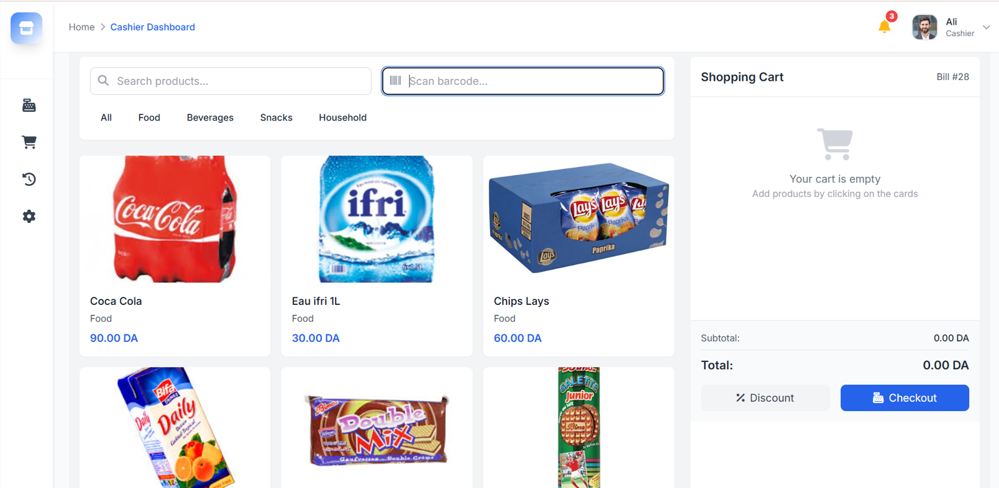
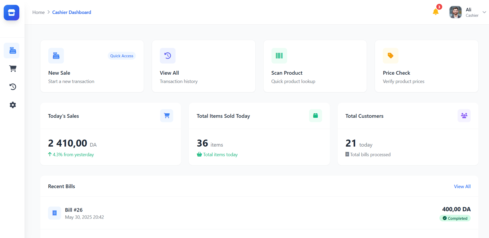

<h1 align="center">🛒 Supermarket Management System (Multi-Branch)</h1>
<p align="center">
  A complete multi-supermarket management system built with <b>Laravel</b> + <b>Tailwind CSS</b>.  
  Designed to connect multiple branches with a central warehouse managed by a magazinier.
</p>

---

## 🚀 About the Project

**Supermarket Pro** is a web-based management system that allows supervisors to manage **multiple supermarkets** under one platform.  
Each supermarket has its **own employees**, **cashiers**, and **local stock**, but all branches are connected to a **central magazinier** who manages the global warehouse inventory— all in **real time**.

This system makes it easy to monitor sales, refill requests, and stock levels across all supermarkets — all in real time.

---

## 🧩 Key Features

### 🏢 Multi-Supermarket Management
- Manage multiple supermarket branches from a single dashboard  
- Each branch has its own supervisor, cashiers, and stock  
- Centralized reporting for all branches  

### 👨‍💼 Supervisor Dashboard
- Oversee employees and monitor branch performance  
- Approve or review refill orders sent to the magazinier  
- Access real-time sales and transaction statistics  

### 📦 Magaziner Stock Management
- Manages the **central warehouse**  
- Receives **refill orders** from supermarkets  
- Updates and distributes stock to each branch accordingly  

### 👩‍💻 Cashier Interface / POS
- Simple, fast, and intuitive POS system  
- Manual barcode entry (no scanner required)  
- Automatically calculates totals and prints bills  
- Records all transactions linked to each branch  

### 📊 Real-Time Monitoring
- Stock alerts and low-inventory notifications  
- Real-time updates using **Laravel Echo + Pusher**  
- Interactive dashboard with live data  

---

## 🖼️ Screenshots

### 🏠 Supervisor Dashboard


### 🏪 Supermarket Management


### 📦 Magaziner Stock


### 👩‍💻 POS 


### 👩‍💻 Cashier Interface

---

## ⚙️ Tech Stack
- 🧩 **Laravel 11**
- 🎨 **Tailwind CSS**
- ⚡ **Alpine.js**
- 🔔 **SweetAlert2**
- 🕒 **Laravel Echo + Pusher** (for real-time notifications)
- 🗄️ **MySQL Database**

---

## 🧑‍💻 Installation

```bash
git clone https://github.com/your-username/supermarket-pro.git
cd supermarket-pro
composer install
npm install && npm run dev
cp .env.example .env
php artisan key:generate
php artisan migrate
php artisan serve
